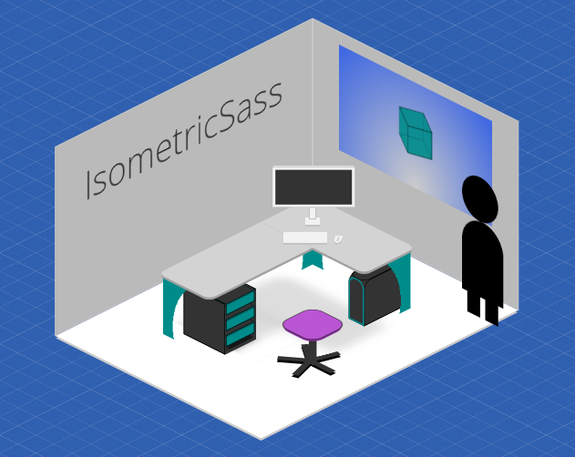

# IsometricSass

## *Sass library of isometric functions*
The use of 3D graphic contexts in JavaScript is often to the detriment of the performance and support of some browsers.

IsometricSass is a Sass framework that requires **no JavaScript**.
It was created to be able to fully use the CSS 3D transformations to create 3D scenes.

### Project Health

---

## Getting Started

## Documentation

For full demo & documentation, visit [https://morgancaron.github.io/IsometricSass/](https://morgancaron.github.io/IsometricSass/)

---

## Additional Informations

